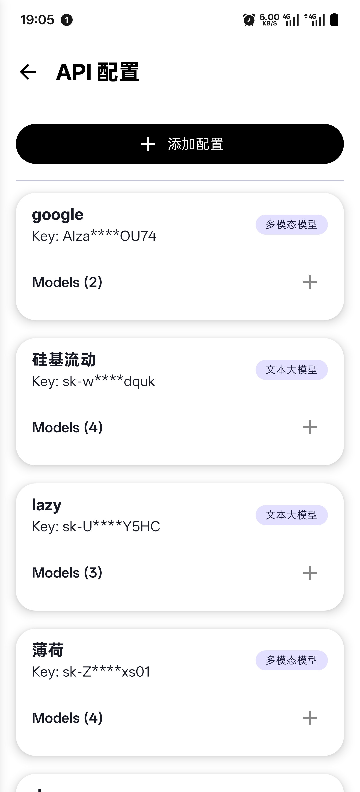
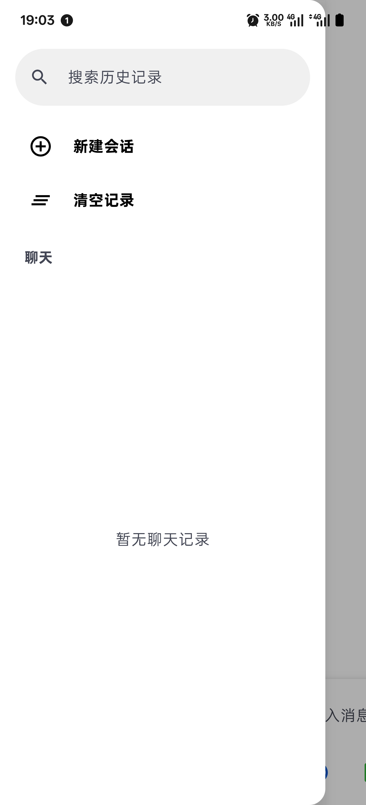

# KunTalk - Your Private, Versatile, and Powerful AI Companion

<p align="center">
  
</p>

<p align="center">
  <strong>一个高度可定制、功能强大的安卓AI聊天客户端，旨在提供极致的灵活性和流畅的对话体验。接入大模型API与之对话，完全开源！</strong>
</p>

<p align="center">
  <a href="https://github.com/roseforljh/KunTalkwithAi/releases/latest"></a>
  <a href="https://github.com/roseforljh/KunTalkwithAi/blob/main/LICENSE.md"></a>
  <a href="https://github.com/roseforljh/KunTalkwithAi/stargazers"></a>
</p>

---

## 目录 (Table of Contents)

- [KunTalk - Your Private, Versatile, and Powerful AI Companion](#kuntalk---your-private-versatile-and-powerful-ai-companion)
  - [目录 (Table of Contents)](#目录-table-of-contents)
  - [🌟 核心功能 (Features)](#-核心功能-features)
  - [📱 截图展示 (Screenshots)](#-截图展示-screenshots)
  - [🛠️ 技术栈 (Tech Stack)](#️-技术栈-tech-stack)
  - [⚙️ 系统要求 (System Requirements)](#️-系统要求-system-requirements)
  - [🚀 安装与使用指南 (Installation \& Usage Guide)](#-安装与使用指南-installation--usage-guide)
    - [1. 快速安装](#1-快速安装)
    - [2. 配置 API](#2-配置-api)
    - [3. 开始聊天](#3-开始聊天)
  - [👨‍💻 面向开发者 (For Developers)](#-面向开发者-for-developers)
    - [从源码构建 (Build from Source)](#从源码构建-build-from-source)
    - [开发者配置（可选）](#开发者配置可选)
  - [📁 项目结构 (Project Structure)](#-项目结构-project-structure)
  - [🔌 后端接口与协议 (Backend API \& Protocol)](#-后端接口与协议-backend-api--protocol)
    - [模式说明（文本 vs 图像）](#模式说明文本-vs-图像)
    - [1) 聊天流式接口（推荐路由：/chat）](#1-聊天流式接口推荐路由chat)
    - [2) 图像生成接口](#2-图像生成接口)
    - [3) 模型列表获取（直连上游）](#3-模型列表获取直连上游)
    - [4) 安全与部署建议](#4-安全与部署建议)
  - [❓ 常见问题 (FAQ)](#-常见问题-faq)
  - [🙏 致谢 (Acknowledgments)](#-致谢-acknowledgments)
  - [📄 许可证 (License)](#-许可证-license)

---

## 🌟 核心功能 (Features)

KunTalk 不仅仅是一个简单的聊天应用，它是一个集成了前沿技术的 AI 交互平台，为您带来桌面级的 AI 体验。

- **✨ 多模型/多平台支持**: 无缝切换不同的 AI 模型和服务商。您可以自由配置和接入任何兼容 OpenAI 格式的 API，无论是本地部署的模型还是云端服务。
- **🌐 联网搜索**: 让 AI 不再局限于训练数据。开启联网模式，AI 可以获取实时信息，为您提供更准确、更有时效性的回答，并附上参考来源。
- **🖼️ 多模态输入**: 交流不止于文字。您可以轻松上传图片，让 AI 理解和分析图像内容，实现更丰富的交互。
- **⚙️ 高度可定制**: 从 API 地址、模型名称到系统提示词（System Prompt），一切尽在您的掌控之中。您可以为不同的场景创建和保存多套配置，一键切换。
- **🚀 流畅的流式响应**: 体验如丝般顺滑的打字机效果，AI 的每一个字都实时呈现在您眼前。我们对滚动逻辑进行了深度优化，确保用户的手动滚动操作永远拥有最高优先级，绝不被 AI 的自动滚动打断。
- **🎨 现代 UI 设计**: 采用最新的 Jetpack Compose 构建，界面简洁、美观，并提供了完善的浅色/深色模式支持。
- **🔍 思考过程可见**: 在 AI 生成答案时，您可以选择查看其“思考过程”或“Reasoning”，了解 AI 是如何一步步得到最终答案的。
- **🔒 隐私优先**: 所有的 API 配置和聊天记录都存储在您的本地设备上，我们不收集任何您的个人数据。

## 📱 截图展示 (Screenshots)

_这里是展示 App 核心界面的地方，建议您替换成自己的截图。_

|                                 主聊天界面                                 |                                 侧边栏/模型切换                                 |
| :------------------------------------------------------------------------: | :-----------------------------------------------------------------------------: |
|  |  |

## 🛠️ 技术栈 (Tech Stack)

本项目采用现代化的技术栈构建，确保了代码的高质量、可维护性和可扩展性。

- **客户端 (Android)**:

  - **语言**: [Kotlin](https://kotlinlang.org/)
  - **UI 框架**: [Jetpack Compose](https://developer.android.com/jetpack/compose) - 用于构建声明式、响应式的原生 UI。
  - **异步处理**: [Kotlin Coroutines](https://kotlinlang.org/docs/coroutines-overview.html) & [Flow](https://kotlinlang.org/docs/flow.html) - 用于处理网络请求、数据库操作等所有异步任务。
  - **网络层**: Ktor Client - 负责流式响应、多部分表单上传、文件与音频附件处理等（详见 ApiClient.kt）。
  - **数据持久化**: SharedPreferences - 用于在本地存储用户配置（参见 SharedPreferencesDataSource）。

- **后端 (代理，聊天/图像生成功能所需)**:
  - 聊天流式与图像生成依赖后端代理；请在构建时配置 BACKEND_URLS 指向你的代理服务（推荐指向 /chat 路由）。
  - 模型列表获取可直接调用你在 UI 中填写的 API 地址的 /v1/models（若该服务支持）。

## ⚙️ 系统要求 (System Requirements)

- Android 设备：最低支持 Android 8.1 (API 27)，目标 API 35，编译 API 36。
- 开发环境：Android Studio（Koala+ 推荐），JDK 17。
- 构建工具链：
  - Gradle Wrapper：8.13（distributionUrl 指向 gradle-8.13-all.zip）。
  - Android Gradle Plugin (AGP)：8.12.2（由 libs.versions.toml 管理）。
  - Kotlin：2.0.0（含 Kotlin Serialization/KSP 2.0.0-1.0.21）。
  - Compose BOM：2024.12.01。

## 🚀 安装与使用指南 (Installation & Usage Guide)

### 1. 快速安装

对于大多数用户，我们推荐直接安装预编译的 APK 包：

1.  前往项目的 [**Releases**](https://github.com/roseforljh/KunTalkwithAi/releases/latest) 页面。
2.  下载最新版本的 `app-release.apk` 文件。
3.  在您的安卓设备上允许“安装未知来源的应用”，然后点击下载的 APK 文件进行安装。

### 2. 配置 API

首次启动应用后，您需要配置连接 AI 模型的 API。

1.  从主屏幕左侧边缘向右滑动，或点击左上角的菜单按钮，打开侧边栏。
2.  在侧边栏中，您会看到默认的配置项。点击下方的 **“添加一套新配置”** 来创建您的专属连接。
3.  在配置页面，您需要填写以下信息：
    - **配置名称**: 给这个配置起一个容易识别的名字 (例如: "我的本地模型")。
    - **API 地址**: 您的 AI 服务 API 端点。聊天流式接口的解析与拼接遵循以下规则：
       - 以 `#` 结尾：移除末尾的 `#` 后，原样使用该地址，不自动添加任何 `/v1/...` 路径。
       - 地址中已包含路径（含有 `/` 且不以 `#` 结尾）：
         - 若以 `/` 结尾：OpenAI 兼容自动补 `/chat/completions`；Gemini 渠道不套用该规则（请直接填写官方固定端点）。
         - 若不以 `/` 结尾：认为用户已提供完整路径，不再自动拼接 `/v1/...`。
       - 既不含 `/`、也不含 `#`：OpenAI 兼容自动补 `/v1/chat/completions`；Gemini 渠道忽略此规则（请直接填写官方固定端点，如 `/v1beta/models:generateContent` 或 OpenAI 兼容网关的完整地址）。
       - 注意：图像生成接口不使用上述 `#` 约定，建议直接提供其自身的完整 URL。
       - 支持任意兼容 OpenAI 的服务端，例如：`http://<host>:<port>/v1/chat/completions`、`http://<host>:<port>/v1`（部分服务自动补路径）。
    - **API 密钥**: 访问服务所需的密钥 (如果不需要，可以留空)。
    - **模型名称**: 您想要使用的具体模型 ID (例如: `gpt-4`, `llama3-70b-8192`)。
    - **系统提示词 (System Prompt)**: 可选。用于设定 AI 的角色和行为。
4.  点击“保存”，您的新配置就会出现在侧边栏列表中。点击即可切换。

提示：应用会将 UI 所选的 ApiConfig 中的 `address`/`key`/`model` 等序列化成 ChatRequest 并交由后端代理处理；未配置后端代理，聊天与图像生成将不可用。模型列表获取可直接请求你填写的 API 地址的 `/v1/models`（若该服务实现该端点）。

### 3. 开始聊天

1.  在侧边栏选择您想使用的配置。
2.  返回主聊天界面，在底部的输入框中输入您的问题。
3.  点击右侧的发送按钮。
4.  您可以通过输入框上方的开关来启用 **联网搜索** 或查看 **思考过程**。
5.  点击输入框左侧的 “+” 号，您可以 **上传图片** 与 AI 进行多模态对话。

## 👨‍💻 面向开发者 (For Developers)

### 从源码构建 (Build from Source)

如果您想自行修改代码或体验最新功能，可以从源码构建应用：

1.  克隆本仓库: `git clone https://github.com/roseforljh/KunTalkwithAi.git`
2.  使用 Android Studio 打开 `KunTalkwithAi/app1` 目录。
3.  等待 Gradle 同步和构建完成。
4.  连接您的安卓设备或使用模拟器，点击 "Run 'app'"。

### 开发者配置（可选）

应用支持通过构建参数注入一个“后端代理 URL 列表”，用于容灾/并发竞速：

- 复制 `app1/local.properties.example` 为 `app1/local.properties`，并按需填写：

```
BACKEND_URLS_RELEASE="http://prod1.example.com/chat,http://prod2.example.com/chat"
BACKEND_URLS_DEBUG="http://127.0.0.1:8000/chat"
```

- 构建脚本会将上面的值注入到 `BuildConfig.BACKEND_URLS` 中，应用启动后由 `BackendConfig.backendUrls` 解析为列表；留空则不使用代理列表。
- 并发竞速开关 `BuildConfig.CONCURRENT_REQUEST_ENABLED` 当前默认关闭，如需开启可在 `app/build.gradle.kts` 相应 `buildTypes` 中改为 `true`。
- 推荐将 URL 指向你后端的聊天路由（例如 `http://127.0.0.1:8000/chat`）；图像生成会在内部去掉尾部 `/chat` 并请求 `{base}/v1/images/generations`。

网络请求策略：
- 若代理列表为空：
  - 聊天与图像生成功能将不可用（应用会提示“未配置后端服务器URL”）。
  - 仅可尝试通过 `/v1/models` 获取模型列表（前提是你的 API 实现该端点）。
- 若配置了代理列表：
  - 串行模式（默认）：按顺序尝试每个代理 URL，直至成功。
  - 并发模式（开启后）：同时向多个代理发起请求，最先成功的连接将被采用。

## 📁 项目结构 (Project Structure)

````
KunTalkwithAi/
├── app1/              # Android 客户端源码 (使用 Android Studio 打开此目录)
│   ├── app/           # 主模块，包含UI、网络、配置等核心逻辑
│   │   ├── src/main/java/com/example/everytalk/
│   │   │   ├── ui/                    # Jetpack Compose UI组件
│   │   │   ├── data/network/          # 网络层（ApiClient.kt、ChatRequest.kt等）
│   │   │   ├── config/                # 配置管理（BackendConfig、ApiConfig等）
│   │   │   ├── model/                 # 数据模型（ChatMessage、StreamEvent等）
│   │   │   ├── state/                 # 状态管理（StateHolder、各种UI状态等）
│   │   │   └── utils/                 # 工具类（文件处理、类型转换等）
│   │   ├── build.gradle.kts           # 模块构建配置
│   │   └── src/main/AndroidManifest.xml
│   ├── gradle/                        # Gradle版本目录管理（libs.versions.toml）
│   ├── local.properties.example       # 后端URL配置示例（复制为local.properties使用）
│   └── build.gradle.kts              # 项目级构建配置
├── .github/           # GitHub Actions 工作流配置
├── imgs/              # README中使用的图片资源
└── README.md          # 就是你正在看的这个文件
````

## 🔌 后端接口与协议 (Backend API & Protocol)

下面描述客户端与后端代理之间的协议、文本/图像两种模式的特点，以及图像模式适配的上游接口范围。客户端实现见 <mcfile name="ApiClient.kt" path="c:\Users\33039\Desktop\anyaitotalked\KunTalkwithAi\app1\app\src\main\java\com\example\everytalk\data\network\ApiClient.kt"></mcfile>；后端核心处理见 <mcfile name="openai.py" path="c:\Users\33039\Desktop\anyaitotalked\backdAiTalk\eztalk_proxy\api\openai.py"></mcfile> 与 <mcfile name="image_generation.py" path="c:\Users\33039\Desktop\anyaitotalked\backdAiTalk\eztalk_proxy\api\image_generation.py"></mcfile>。

- 开源后端代理项目仓库： [backdAiTalk](https://github.com/roseforljh/backdAiTalk)

### 模式说明（文本 vs 图像）
- 文本模式（聊天）：
  - 通过 multipart/form-data 上传 ChatRequest JSON 与附件（图片/文件/音频），后端统一转成上游可接受格式并发起请求；响应以 text/event-stream 逐行 JSON 返回，包含增量文本、工具调用、状态更新等事件，末尾以 [DONE] 终止。
  - 特点：流式实时显示、可附带多模态输入（图/音/文档），对不同上游进行协议归一化，确保前端只需消费统一的 AppStreamEvent 流。
  - 说明：当使用支持“图像预览/生成”的聊天模型（如 Gemini Image 预览）时，聊天流中可能插入类型为 image_generation 的事件，以便前端即时展示生成图像。
- 图像模式（生图/图编）：
  - 使用 JSON 请求直达后端的图像生成路由，后端依据模型/服务商自动选择上游调用方式，并将不同返回结构归一化为统一的响应。
  - 特点：既支持“纯文生图”，也支持“图文编辑”（在 contents 中携带原图 inline_data 进行编辑）；返回统一的 images 列表（URL 或 data URL）、可选文本说明、耗时、种子等。

### 1) 聊天流式接口（推荐路由：/chat）
- 方法：POST
- 路径：/chat（建议将 BACKEND_URLS 指向该路由，例如 http://127.0.0.1:8000/chat）
- 请求头：
  - Content-Type: multipart/form-data
- 请求体（multipart/form-data）：
  - 字段 json：字符串，内容为 ChatRequest 的 JSON（模型、消息、联网、工具、系统提示等）。
  - 字段 files：可选，多个文件（图片/音频/文档等），客户端自动根据 MIME 类型和文件名上传。
- 响应：text/event-stream，按行返回形如 `data: {JSON}\n\n` 的 SSE；以 `data: [DONE]` 结束。
- 约定（api_address 解析规则）：
-   - 含 `#`：去掉 `#` 后直接使用该地址，不再自动拼接 `/v1/...`。
-   - 含 `/` 且不含 `#`：认为地址已带路径，不再自动拼接 `/v1/...`。
-   - 既不含 `/` 也不含 `#`：自动拼接默认路径（OpenAI 兼容为 `/v1/chat/completions`；Gemini 为 `/v1beta/models:generateContent`）。
+ 约定（api_address 解析规则）：
+   - 以 `#` 结尾：移除末尾 `#` 后，原样使用该地址，不自动添加任何 `/v1/...` 路径。
+   - 地址中已包含路径（含有 `/` 且不以 `#` 结尾）：
+     - 若以 `/` 结尾：OpenAI 兼容自动补 `/chat/completions`；Gemini 渠道不套用该规则（请直接填写官方固定端点）。
+     - 若不以 `/` 结尾：认为用户已提供完整路径，不再自动拼接 `/v1/...`。
+   - 既不含 `/`、也不含 `#`：OpenAI 兼容自动补 `/v1/chat/completions`；Gemini 渠道忽略此规则（请直接填写官方固定端点）。
- 参考实现：<mcfile name="openai.py" path="c:\Users\33039\Desktop\anyaitotalked\backdAiTalk\eztalk_proxy\api\openai.py"></mcfile>

### 2) 图像生成接口
- 方法：POST
- 路径：
  - /v1/images/generations（推荐：硅基流动/快手免费生图模型；侧重文生图）
  - /chat/v1/images/generations（推荐：Google Gemini nano/banana 图像模型；支持图片编辑，需在 contents 携带 inline_data 原图）
- 请求头：
  - Content-Type: application/json
- 请求体（关键字段）：
  - model：模型名称。
  - prompt：文生图提示词（图文编辑场景下，可同时在 contents 里提供文本 part）。
  - image_size：输出尺寸（如 1024x1024）。
  - batch_size、num_inference_steps、guidance_scale：可选的生成参数。
  - apiAddress、apiKey：上游服务地址与密钥。
  - contents：可选，图文编辑时使用。形如 [{"text": "..."}, {"inline_data": {"mime_type": "image/png", "data": "<base64>"}}]。
- 响应（统一格式）：
  - { images: [{ url }...], text?: string, timings?: object, seed?: number }
- 适配的三个上游接口/格式（自动归一化）：
  1. OpenAI 兼容图像生成（DALL·E / SD 家族）：返回 data[].url 或 data[].b64_json，或 images[] / output.images[] / image.b64_json 等变体；后端统一解析为 images 列表。
  2. Gemini 原生图像接口（Google Generative Language API）：从 candidates[].content[].parts[].inlineData.data 解析出图片数据并转为 data URL。
  3. OpenRouter 针对 Gemini Image 的非标 OpenAI-compat 流/响应：支持从 chat/completions 风格的 content 中提取 {url|b64_json}，以及聊天流中的图像预览事件并归一化。
- 提示：末尾 `#` 仅影响聊天接口，不影响图像生成接口；图像接口请提供可直达的 apiAddress。
- 参考实现：<mcfile name="image_generation.py" path="c:\Users\33039\Desktop\anyaitotalked\backdAiTalk\eztalk_proxy\api\image_generation.py"></mcfile>

### 3) 模型列表获取（直连上游）
- 客户端会直接请求你在 UI 中填写的 API 地址的 /v1/models（若该服务支持）。
- 用途：用于快速获取可用模型列表并填充配置。

### 4) 安全与部署建议
- 建议将后端代理部署在受控环境，开启访问控制与速率限制。
- 生产环境使用 HTTPS，避免明文传输 apiKey。

我们非常欢迎社区的贡献！如果您有任何好的想法或发现了Bug，请通过以下方式参与进来：

- **报告Bug**: 通过 [GitHub Issues](https://github.com/roseforljh/KunTalkwithAi/issues) 提交您发现的问题。请尽可能详细地描述问题和复现步骤。
- **功能建议**: 有很酷的功能想加入？同样可以通过 [GitHub Issues](https://github.com/roseforljh/KunTalkwithAi/issues) 来告诉我们。
- **提交代码**:
  1. Fork 本仓库。
  2. 创建您的特性分支 (`git checkout -b feature/AmazingFeature`)。
  3. 提交您的更改 (`git commit -m 'Add some AmazingFeature'`)。
  4. 推送到分支 (`git push origin feature/AmazingFeature`)。
  5. 打开一个 Pull Request。

## ❓ 常见问题 (FAQ)

**Q: 为什么我无法连接到我的本地模型服务？**
**A:** 请检查以下几点：
1.  确保您的手机和运行本地模型的电脑在同一个局域网 (Wi-Fi) 内。
2.  在KunTalk的API地址中，使用了您电脑的正确局域网IP地址 (例如 `192.168.1.x`)，而不是 `localhost` 或 `127.0.0.1`。
3.  检查您电脑的防火墙设置，确保端口（如8000）是开放的，允许来自局域网的连接。
4.  确保您的本地模型服务已经成功运行，并且监听的是 `0.0.0.0` 而不是 `127.0.0.1`，这样才能接受外部连接。

**Q: 联网搜索功能是如何实现的？**
**A:** 联网搜索功能由后端代理实现。当检测到需要联网时，后端会使用搜索引擎进行搜索，将搜索结果整合后作为上下文信息提供给AI模型，最终生成有时效性的回答。

**Q: 我可以添加其他模型（比如 Google Gemini）的支持吗？**
**A:** 当然可以！后端代理（`backdAiTalk`）的设计初衷就是为了适配不同的API。您可以在 `backdAiTalk/eztalk_proxy/api/` 目录下参考实现，编写一个新的转换器来适配您想接入的模型API，然后将其整合到路由中。

## 🙏 致谢 (Acknowledgments)

- 感谢所有为本项目提供灵感和支持的开源社区。
- 特别感谢以下项目，它们是KunTalk构建的基石：
  - Jetpack Compose
  - Kotlin Coroutines
  - Ktor Client
  - FastAPI

## 📄 许可证 (License)

本项目采用 [MIT License](https://github.com/roseforljh/KunTalkwithAi/blob/main/LICENSE.md) 开源许可证。

